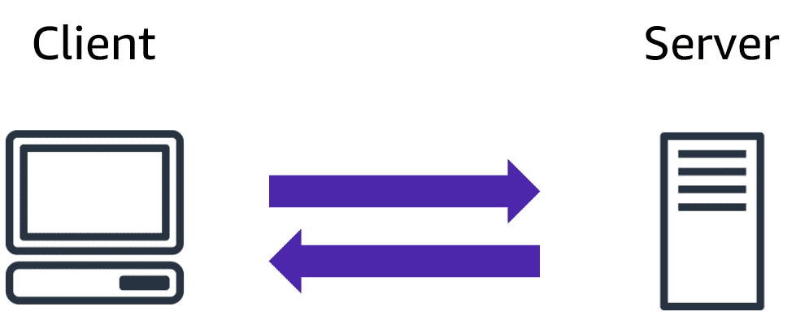

# Amazon Web Services (AWS)

AWS (Amazon Web Services) is a cloud computing platform. The first product (S3) was released in 2006. As of 2925, it is now one of the largest cloud provider in the world.

### The Client-Server Model
The client-server model is an important concept in cloud computing. It is about multiple clients using services from a centralized server.

### What is Cloud Computing?
Cloud computing is a computing service made available over the internet. Cloud computing is a pay-as-you-go model for delivering IT resources. You pay only for what you use.

### Deployment Models
There are three different kinds of deployment models:

* Cloud-based
* On-premises
* Hybrid

The models are different ways of accessing compute services - over the internet, locally, or in a combination.

#### Cloud-Based Deployment
Everything runs in the cloud.

This model allows you to build new applications or move existing ones to the cloud.

There are different levels of services ranging from low to high.

The level of service has different requirements on your management, architecting, and infrastructure.

For example, a company might create an application consisting of virtual servers, databases, and networking components entirely based in the cloud.

#### On-Premises Deployment
Deploy resources by using virtualization and resource management tools.

    On-Premises Deployment is also known as private cloud deployment.

For example, you might have applications that run on technology that is fully kept in your on-premises data center.

Though this model is much like legacy IT infrastructure, its application management and virtualization technologies make it more effective.

#### Hybrid Deployment
In a hybrid deployment, you connect cloud resources to an on-premises infrastructure.

This approach is relevant in many situations.

    For example, you are working with sensitive data or are under specific government regulations.

