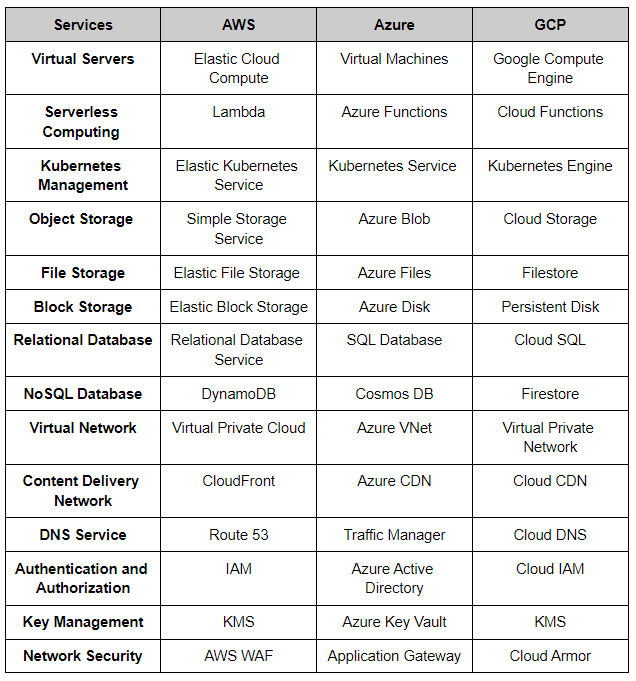

# Cloud Computing

Amazon Web Services (AWS), Microsoft Azure, and Google Cloud Platform (GCP) are three of the largest and most popular cloud computing platforms. Each platform offers a wide range of cloud services, but they have their own strengths, features, and pricing structures. Here's a high-level comparison of these cloud platforms:

