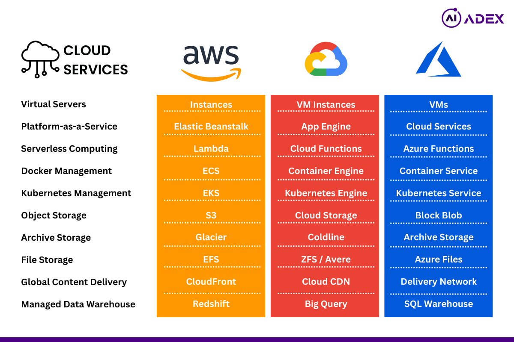
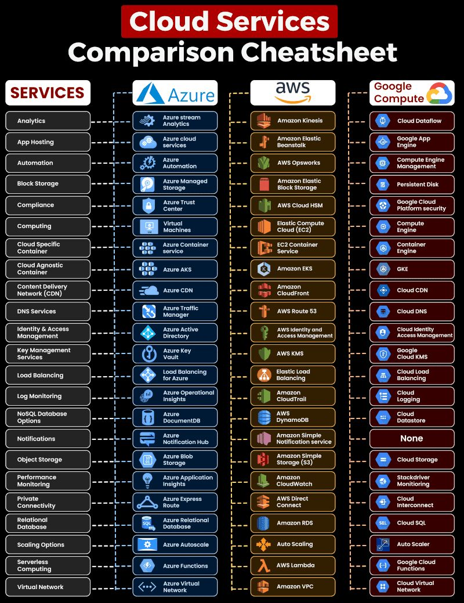

# Cloud Computing

Amazon Web Services (AWS), Microsoft Azure, and Google Cloud Platform (GCP) are three of the largest and most popular cloud computing platforms. Each platform offers a wide range of cloud services, but they have their own strengths, features, and pricing structures. Here's a high-level comparison of these cloud platforms:

1. Market Share:

 - AWS has the largest market share and was one of the pioneers in cloud computing.
 - Azure is the second-largest and has a strong presence in the enterprise market.
 - GCP has been growing steadily and is known for its data and machine learning services.

2. Service Offerings:

 - AWS: Offers a comprehensive range of services, including computing, storage, databases, machine learning, IoT, and more.
 - Azure: Provides a wide array of services, with a strong focus on integration with Microsoft products, like Windows Server, SQL Server, and Active Directory.
 - GCP: Excels in data analytics and machine learning services, and it also offers a wide variety of other cloud services.

3. Pricing Model:

 - AWS, Azure, and GCP all use a pay-as-you-go pricing model. However, pricing can vary depending on the specific services and regions you use.
 - All three platforms offer free tiers with limited resources for getting started and experimenting.

4. Global Reach:

 - AWS, Azure, and GCP have data centers in multiple regions across the globe. AWS has the most extensive global infrastructure, followed by Azure and GCP.

5. Hybrid and On-Premises Integration:

 - Azure has a strong focus on hybrid cloud solutions, with services like Azure Arc that allow you to manage resources both in the cloud and on-premises.
 - AWS and GCP also provide tools for hybrid cloud integration, but Azure is often seen as a leader in this area.

6. Machine Learning and AI:

 - GCP is known for its strong offerings in machine learning and artificial intelligence, including TensorFlow and BigQuery ML.
 - AWS provides a wide range of AI and ML services, such as Amazon SageMaker and AWS Deep Learning AMIs.
 - Azure offers AI and machine learning tools like Azure Machine Learning and Azure Cognitive Services.

7. Developer and DevOps Tools:

 - AWS provides a rich set of developer tools and resources, including AWS Cloud9 and CodePipeline.
 - Azure offers a suite of developer tools and services under Azure DevOps, and it has strong support for .NET and Visual Studio.
 - GCP provides tools like Cloud Source Repositories and Cloud Build.

8. Ecosystem and Community:

 - AWS has a large and active user community, with a wide range of resources and third-party integrations.
 - Azure benefits from its integration with Microsoft products and services and has a strong presence in the enterprise space.
 - GCP is known for its data and machine learning community and is popular among data scientists and researchers.

9. Security and Compliance:

 - All three cloud platforms prioritize security and compliance. They offer a range of security services and compliance certifications to meet various industry requirements.

Ultimately, the choice between AWS, Azure, and GCP depends on your specific needs, existing technologies, and preferences. Many organizations use a combination of these cloud providers for different workloads or regions to leverage the strengths of each platform.

# References

https://www.linkedin.com/pulse/hybrid-cloud-comparison-aws-azure-google-platforms-shreejit-jadhav-yitrf/

https://www.reddit.com/r/dataengineering/comments/13oaw8m/cloud_comparison_by_simonholdorf/?rdt=46684

https://cloud.google.com/free

