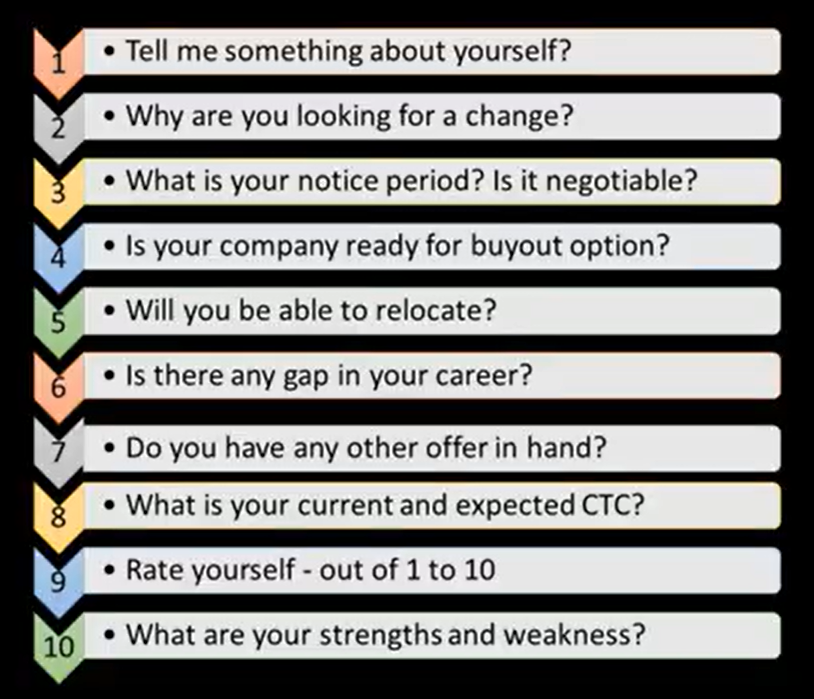
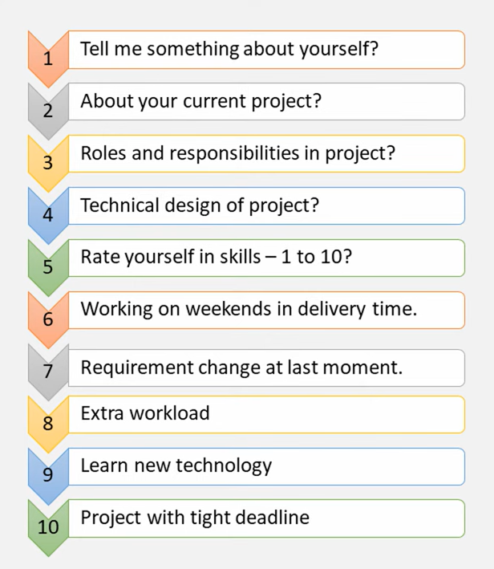
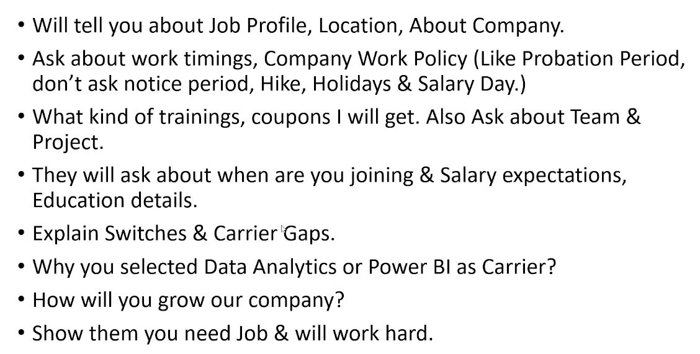
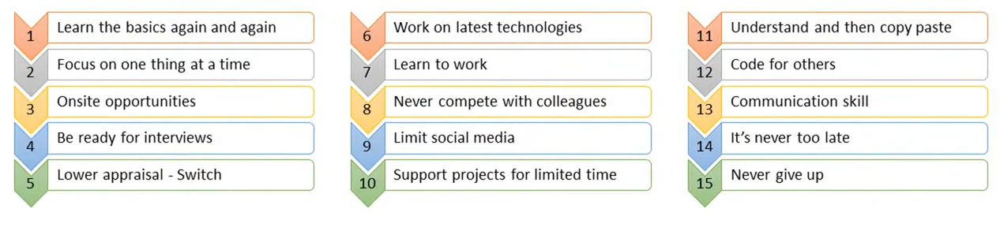

# Rounds

1. HR Round #1 - screening

2. Technical Round #1 - with Tech Lead

3. Technical Round #2 - with Software Architect

4. Manager Round - with Project Manager

5. HR Round #2 - salary etc

# Experience

# Reference

Top 10 HR Interview Question and Answers asked in IT/Software Industries

https://www.youtube.com/watch?v=e_3oBQhtWrg

Top 10 Manager Round Interview Questions and Answers in IT and Software Industry

https://www.youtube.com/watch?v=uC8OALy53EU

15 Tips from 15 years experience in IT Industry

https://www.youtube.com/watch?v=JmBn1GsScOc

Final HR Round Interview Questions | Final HR Round | HR Round Interview Questions

https://www.youtube.com/watch?v=-m9ykq_jHeA
